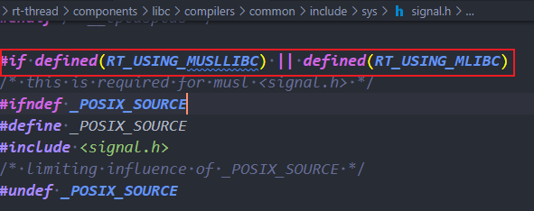
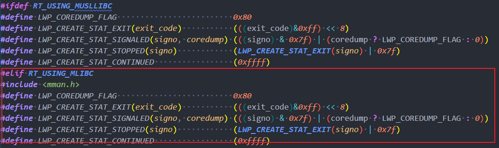
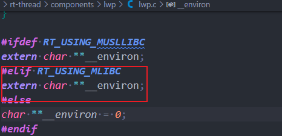

### 在RT-Thread中使用mlibc时需要加入进行以下更改

在`rt-thread/components/libc/compilers/common/include/sys/signale.h`文件中进行以下更改：

### 在RT-Smart中使用mlibc时需要加入进行以下更改

> 基于能编译通过RT-Thread的基础上

在`rt-thread/components/lwp/lwp.h`文件中进行修改

在`rt-thread/components/lwp/lwp.c`文件中进行修改

更改完指定文件后需要进入`menuconfig`开启**timerfd**和**epoll**功能

完成上述步骤后进行编译即可。